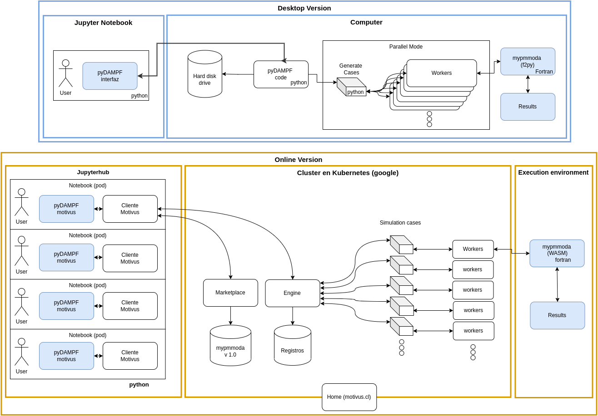

# Summary

pyDAMPF is a community-oriented Atomic Force Microscopy (AFM) tool, which allows the simulation of the physical properties of materials under varying relative humidity (RH). As shown in the paper by cite [@MenachoScipy:2022], an online version is introduced for mass use of the program through the Motivus server, with a much more user-friendly interface, which facilitates interaction with the user both in the use and in the visualization of results. 

Motivus solves two fundamental problems. The first one is associated with the high computational load of its algorithm: using the Motivus engine, the Motivus API sends each simulation case to a worker, a node in charge of solving the simulation and returning the result. Distributing the computation in this way allows to obtain results 200 times faster than a personal computer. 

The second problem is associated with the maintenance and accessibility of the algorithm to other scientists. The pyDAMPF algorithm is hosted in the motivus marketplace which allows other scientists to access its functions using the motivus library in their applications. In this way, they can obtain results in reasonable times, without the need for installations or additional computational resources to those already provided by Motivus.

This article shows the adaptation of the code published by [@MenachoScipy:2022] for an online version. The calculation engine is written in Fortran adapted in C for compilation in WASM on Motivus servers running the calculations in a Kubernetes cluster (google) and wrapped in Python with a Jupyterhub interface, even giving the possibility to store the simulations for each user individually \autoref{fig:esquema}. This is intended to provide the user with a powerful tool for AFM experiments.

# Statement of need

Esta parte ya no es del paper, es el ejempo que nos da JOSS

`Gala` is an Astropy-affiliated Python package for galactic dynamics. Python
enables wrapping low-level languages (e.g., C) for speed without losing
flexibility or ease-of-use in the user-interface. The API for `Gala` was
designed to provide a class-based and user-friendly interface to fast (C or
Cython-optimized) implementations of common operations such as gravitational
potential and force evaluation, orbit integration, dynamical transformations,
and chaos indicators for nonlinear dynamics. `Gala` also relies heavily on and
interfaces well with the implementations of physical units and astronomical
coordinate systems in the `Astropy` package [@astropy] (`astropy.units` and
`astropy.coordinates`).

`Gala` was designed to be used by both astronomical researchers and by
students in courses on gravitational dynamics or astronomy. It has already been
used in a number of scientific publications [@Pearson:2017] and has also been
used in graduate courses on Galactic dynamics to, e.g., provide interactive
visualizations of textbook material [@Binney:2008]. The combination of speed,
design, and support for Astropy functionality in `Gala` will enable exciting
scientific explorations of forthcoming data releases from the *Gaia* mission
[@gaia] by students and experts alike.

# Mathematics

Single dollars ($) are required for inline mathematics e.g. $f(x) = e^{\pi/x}$

Double dollars make self-standing equations:

$$\Theta(x) = \left\{\begin{array}{l}
0\textrm{ if } x < 0\cr
1\textrm{ else}
\end{array}\right.$$

You can also use plain \LaTeX for equations
\begin{equation}\label{eq:fourier}
\hat f(\omega) = \int_{-\infty}^{\infty} f(x) e^{i\omega x} dx
\end{equation}
and refer to \autoref{eq:fourier} from text.

# Citations

Citations to entries in paper.bib should be in
[rMarkdown](http://rmarkdown.rstudio.com/authoring_bibliographies_and_citations.html)
format.

If you want to cite a software repository URL (e.g. something on GitHub without a preferred
citation) then you can do it with the example BibTeX entry below for @fidgit.

For a quick reference, the following citation commands can be used:
- `@author:2001`  ->  "Author et al. (2001)"
- `[@author:2001]` -> "(Author et al., 2001)"
- `[@author1:2001; @author2:2001]` -> "(Author1 et al., 2001; Author2 et al., 2002)"

# Figures

Figures can be included like this:

and referenced from text using \autoref{fig:example}.

Figure sizes can be customized by adding an optional second parameter:
{ width=20% }

# Acknowledgements

We acknowledge contributions from Brigitta Sipocz, Syrtis Major, and Semyeong
Oh, and support from Kathryn Johnston during the genesis of this project.

# References
